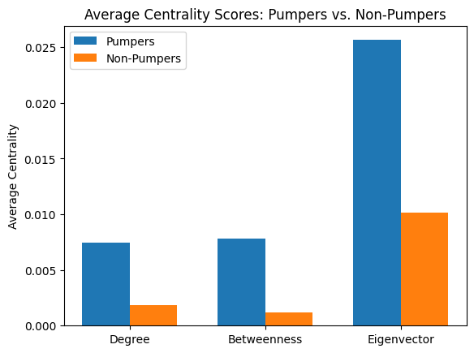
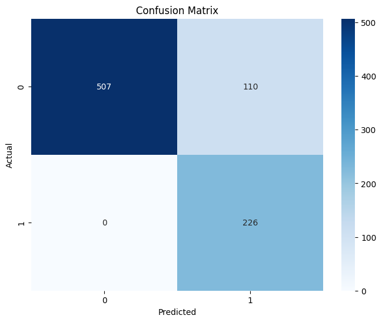

# Detecting Pump and Dump Schemes on Twitter using Machine Learning and Network Analysis 


## Table of contents

1.  [Project Title and Description](#project-title-and-description)
2.  [Installation](#installation)
3.  [Data Acquisition](#data-acquisition)
4.  [Data Preprocessing](#data-preprocessing)
5.  [Feature engineering](#feature-engineering)
5.  [Machine Learning Models](#machine-learning-models)
6.  [Network Analysis](#network-analysis)
7.  [Usage](#usage)
8.  [Results and Evaluation](#results-and-evaluation)
9.  [Contributing](#contributing)
10. [License](#license)
11. [Contact](#contact)


### Project Title and Description <a name="project-title-and-description"></a>

This project aims to detect and analyze pump and dump schemes on Twitter by leveraging machine learning and network analysis techniques. We utilize Twitter data to identify suspicious patterns in stock-related discussions, employing machine learning models for classification and network analysis to uncover influential actors and community dynamics indicative of manipulative trading practices.

### Installation <a name = "installation"></a>

Install the required libraries used in this project

pip install -r requirements.txt


### Data acquisition <a name = "data-acquistion"></a>

In this project, we used primarily used a labeled twitter tweets dataset, found on kaggle to train our model and detect/flag out potential


**1. Labeled Twitter Data:**

* We leverage the "Stock Related Tweet Sentiment" dataset from Kaggle, available at [https://www.kaggle.com/datasets/mattgilgo/stock-related-tweet-sentiment](https://www.kaggle.com/datasets/mattgilgo/stock-related-tweet-sentiment).
* This dataset provides a collection of tweets related to various stocks, along with sentiment labels, which are crucial for training our machine learning models.
* The dataset was downloaded directly from Kaggle, and the relevant CSV files were used for the project.
* Please download the dataset from the link provided and place the files in a `data/scored_tweets_total.csv` directory within the project folder.

**2. Historical Stock Data:**

* Historical stock data for the stocks mentioned within the tweets was obtained using the `yfinance` library.
* `yfinance` provides a convenient interface to download stock data from Yahoo Finance.
* The script within the project dynamically extracts stock tickers from the tweet dataset and retrieves corresponding historical price and volume data.
* This stock data is essential for correlating tweet sentiment and network activity with actual stock price movements, allowing us to identify potential pump and dump patterns.


### Data preprocessing <a name = "data-preprocessing"></a>

For the data preprocessing, we ensure that the datetime columns from the tweets and stock price data were converted to datetime objects and timezone information was also removed to ensure consistency before merging the datasets together and feature engineering. Next, for the text preprocessing, we converted all the emojis from the tweets into text description using emoji.demojize. We also remove the URLs, mentions and punctuations from the text then convert all of them to lowercase. Finally, we converted NaN values into empty strings. For handling of missing values in our datasets, those rows with missing ‘Known_Pumper’ values were dropped because that was the target variable. For features used in modeling, missing values introduced during lagging or merging were filled with 0 (fillna(0)). This assumes missingness implies the absence of the event (e.g., no prior day's close data available at the start). Finally, we merge the tweets dataset with the stock prices dataset based on the stock ticker and the date then remove any duplicated columns that resulted from the merging.


1. Graph network of tweeters (Users)
Next, as we look at the ‘Improved Pumper Network’ graph below, those users that are ‘known pumpers’, as represented by the red nodes, occupy key positions in the graph such that they act as central hubs or bridges within the communication network. 
It should be noted, there is not many connections and this graph is rather sparse.


2. Centrality analysis

It is then statistically validated using the ‘Average Centrality Scores: Pumpers vs Non-Pumpers’ bar chart and the T-test table below. This shows that the known pumpers have much higher average degree, betweenness and eigenvector centrality compared to non-pumpers. This could suggest that the pumpers not only interact with more users directly (degree) and bridge different groups (betweenness), but they are also connected to other influential users (eigenvector), further increasing their connections and impact on their network.




### Feature engineering <a name = "feature-engineering"></a>

Feature engineering: 

To enhance the model's ability to detect potential pump-and-dump schemes within tweets, several new features were created by extracting information from the tweet text content and the social network structure derived from user mentions. These features capture different aspects of the communication style and user influence often associated with such schemes.

We hypothesized that the number of “random” text included in a tweet would have a higher chance of being a tweet, such things include number of urls tweeted by a user, number of emojis used, number of pumping keywords identified. Thus, we created features that represent such concepts under the “Text content features”

1. Text Content Features:

- hashtag_count: Number of Hashtags used in a tweet.
- emoji_count: Number of emojis used in a tweet.
- keyword_count: Number of specific hype/stock-related keywords. Specific keywords we have identified that 
- stock_ticker_count: Number of stock tickers mentioned in a tweet
- Url_count: Number of web links.

2. Network Features:

- degree_centrality: User's network connection count (normalized).
- betweenness_centrality: User's importance as a bridge in the network.
- eigenvector_centrality: User's influence based on connections to influential users.
- mentions_by_others: Count of mentions received by other users in the network.
- handles_mentioned: For every tweet, how many other twitter handles does the user mention.
- frequency_change (1D/3D): The cumulative count of a user's tweets within the preceding 1-day and 3-day time windows, respectively, up to each tweet's 
- timestamp. These values reflect the user's recent tweeting activity. This is a metric used to see if there are any sudden changes in tweet activity level.
- retweet_count: This provides insight into a user's engagement with and propagation of content shared by others within the Twitter network. A high retweet count means that the user often retweets other’s retweets for the sake of propagation.

3. Probabilistic User Features:
- user_pumper_probability: Predicted probability that a user is a pumper (based on network features).
- pumper_category: Binary (0/1) classification based on user_pumper_probability threshold.

4. Text Representation:
- TF-IDF Features: Numerical vectors derived from tweet text, weighting word importance (term frequency-inverse document frequency).


### Machine learning models <a name = "machine-learning-models"></a>

For the machine learning portion, we split this problem into 2 different situations.

#### Text based model

For analyzing individual text data, we process the text information into the Text Content features as well as the Text representation in feature engineering. We then make use of Gradient Boosting model to predict whether the user is a pumper or not. These texts that have been flagged are identified as suspicious and made to be used by our second model. 

The training portion for this can be found in ```text_model_training.ipynb```

The final model we used can be found in ```model/gradient_boosting_balanced_best_w_smote_pipeline.joblib```

#### Network based model

After passing the data through the first model, which is less computationally expensive, the suspicious usernames are then passed into the network based model and we verify whether or not the user is a pumper. The model used in this portion is also XGBoost, and we made use of the "Network Features" portion of the feature engineering portion.

The training portion for this can be found in ```model_training/network_analytics_models.ipynb```

The final model used can be found in ```model_training/models/network_analysis_XGBoost_model_2.joblib```


### Usage

To simulate doing this and validate using our model, we took the entire dataset ```data/scored_tweets_final_translated.csv```, passed it into a train_test_split to extract a test dataset, which was 20% of the original dataset, and fed it into our text based model. 

The model initially identified 96 tweets that are potentially suspicious. From this 96 tweets, we extracted the usernames and then performed network analysis using the network_analysis model identified earlier.

It should be noted that in the entire dataset, there are only 360 tweets that are identified to be classified as pump-tweets. 

With only 20% of the original data used, we predicted 96 tweets, and using these 96 tweets, we manage to trace back to the unique users, and after reviewing each user's tweets and network analytics metrics, such as their centrality scores, we managed to identify 226 pump tweets, which is a great result to achieve.




